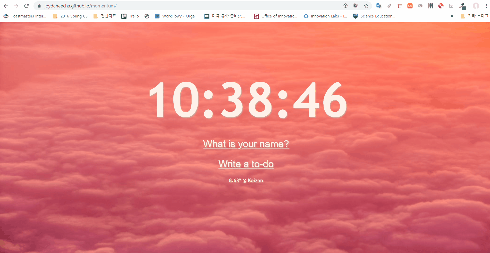

# Momentum

## Project link
https://joydaheecha.github.io/momentum/

## Project demo

## Project description
Momentum program improves your productivity by showing to-do list and pleases you eyes with great pictures.
Customize the program by addding your favorite pictures. 
모멘텀 프로그램은 사용자의 생산성을 높여주는 to-do-list 프로그램입니다. 좋아하는 사진들로 화면을 꾸며보세요!
### Features
This program shows
- Time (시간)
- Your name (사용자 이름)
- to do list (할 일 목록)
- Your location with current temperature(사용자 현 위치 및 온도)

## How to run this proejct
It's pretty simple! Download the project and execute index.html.
Change images in 'images' folder if you want. Enjoy customizing the project!
프로젝트를 다운 받은 후 index.html 파일을 실행하시면 됩니다. 

## What I used for this proejct
- openweathermap api
    - for gettng location and temperature
- localStorage in JS
    - for saving to-do-list. 

## How to reset lcoalStorage
Go to developer tool(F12) - Application - Storage - Local Storage - Clear All
